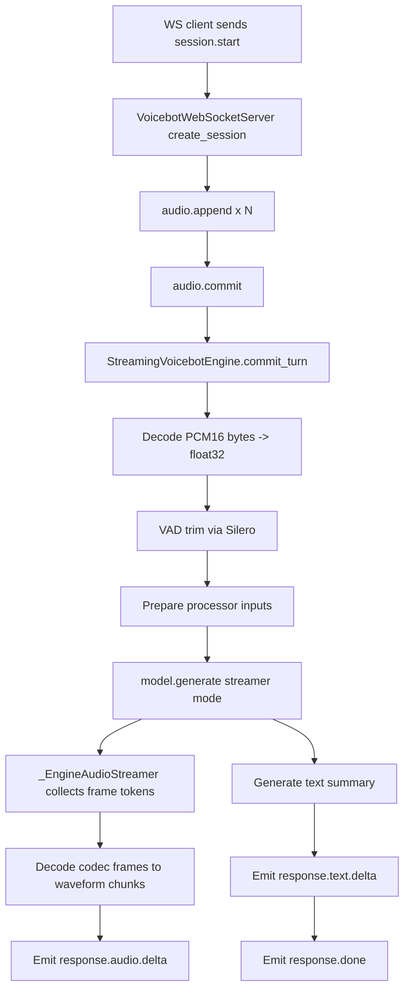

# Chroma Streaming Runtime 說明

本文描述目前專案中 Chroma voicebot 的 streaming 執行方式，包含：
- 請求輸入格式
- runtime 內部模組如何調度
- 串流輸出事件與生命週期

## 1. 主要模組

- 核心引擎：`chroma/engine/streaming_engine.py`
  - `StreamingVoicebotEngine`
  - `_EngineAudioStreamer`
- 事件型別：`chroma/engine/types.py`
- WebSocket transport：`chroma/transport/ws_server.py`
- 啟動入口：`scripts/run_voicebot_ws.py`

## 2. 輸入（Input Contract）

### 2.1 WebSocket Client -> Server 事件

1. `session.start`
- 用途：建立 session 與初始 config
- 範例：
```json
{"type":"session.start","session_id":"demo-1","config":{"speaker":"scarlett_johansson","memory_turns":6,"output_chunk_sec":0.5,"text_mode":"sentence","include_transcript_in_query":false}}
```

2. `audio.append`
- 用途：持續累積單一回合的語音 bytes
- `audio_b64`：base64 的 PCM16LE/16k/mono 音訊片段
```json
{"type":"audio.append","session_id":"demo-1","audio_b64":"..."}
```

3. `audio.commit`
- 用途：觸發一次回合推論
- `transcript` 可選（若有，會先寫入 user memory）
- `transcript` 來源是 client 端（或 client 前面的 ASR 服務）先轉寫後再帶入，server 端不會自行做 STT。
- 若 client 不送 `transcript`，本回合仍可用 audio 正常推論，但記憶只會新增 assistant 文字（除非後續回合有帶 transcript）。
- `include_transcript_in_query`（session config，預設 `false`）：
  - `false`：維持目前行為，`transcript` 只進 memory，不進本回合 query。
  - `true`：本回合 query 會用 `text + audio` 一起送入 thinker/backbone。
- 若 server 啟用 `--server-asr-model`，`audio.commit.transcript` 會被忽略，改由 server 端用當前 turn 的 audio buffer 轉寫。
```json
{"type":"audio.commit","session_id":"demo-1","transcript":"optional"}
```

#### transcript 來源實務

- Browser/WebRTC client：可用 Web Speech API、Whisper API、或自建 ASR，將文字放進 `audio.commit.transcript`。
- Python mic client（`scripts/run_voicebot_ws_mic_client.py`）目前預設只送音訊與 `audio.commit`，不內建 STT；若要寫入 user memory，需在 client 端加一段即時轉寫再填入 `transcript`。
- 若不希望 client 參與轉寫，可在 server 啟動時加上 `--server-asr-model`，由 server 在每次 `audio.commit` 前執行 ASR 並自動寫入。

4. `response.cancel`
- 用途：要求中斷目前回覆（barge-in）
```json
{"type":"response.cancel","session_id":"demo-1"}
```

5. `session.update` / `session.end`
- 更新 config（可包含 `include_transcript_in_query`）或結束 session。

### 2.2 音訊格式與限制

- Input audio：PCM16LE, 16kHz, mono（由 client 保證）
- `StreamingVoicebotEngine.append_audio()` 以 bytes 累積到 session ring buffer
- session buffer 上限：`max_input_seconds * 16000 * 2` bytes

## 3. 執行流程（模組調度）



### 3.1 `commit_turn()` 詳解

`StreamingVoicebotEngine.commit_turn(session_id)` 做的事：

1. 取出 session 狀態
- 若有上一次 active turn，先設 cancel flag（避免重疊回合）
- 取出 `audio_buffer`（本回合音訊）並清空
- 建立新的 `turn_id` 與 `cancel_event`

2. 前處理
- `pcm16le_bytes_to_float32_mono()`：bytes -> waveform
- `_resample_audio()`：確保 16k
- `_trim_with_vad()`：Silero VAD 擷取語音區段
- 過短音訊直接回 `error(audio_too_short)`

3. 組推論輸入
- `_prepare_inputs()`：
  - 載入 prompt speaker 參考 audio/text
  - 拼接 system prompt + memory context
  - 依 `include_transcript_in_query` 決定本回合 user content 是 `audio` 或 `text + audio`
  - 交給 processor 產生 thinker/backbone 所需 tensor
  - tensor 移動到 model device/dtype

4. 啟動串流生成
- 背景 thread 執行 `model.generate(..., streamer=...)`
- streamer 每滿 `frames_per_chunk`：
  - codec decode -> waveform chunk
  - 轉 PCM16 + base64
  - emit `response.audio.delta`

5. 文字輸出與收尾
- `_generate_text()`：用 thinker 生文字（依 `text_mode`）
- emit `response.text.delta`（若有）
- emit `response.done(metrics)`
- 若取消：emit `response.cancelled`

### 3.2 中斷（Cancel/Barge-in）

- API：`cancel_response(session_id)`
- 行為：
  - 設定 `active_cancel_event`
  - streamer 與生成 thread 觀察到 cancel 後提前結束
  - 回傳 `response.cancelled`

注意：
- `AbortOnCancelCriteria` 目前會被 Chroma generation mixin 過濾（`generation_chroma.py` 僅保留 `MaxLengthCriteria`）。
- 實際中斷主要依賴 streamer 側 cancel path。

## 4. 輸出（Output Contract）

引擎事件定義在 `chroma/engine/types.py`。

1. `response.started`
```json
{"type":"response.started","session_id":"demo-1","turn_id":"3"}
```

2. `response.audio.delta`
```json
{"type":"response.audio.delta","session_id":"demo-1","turn_id":"3","audio_b64":"...","sample_rate":24000,"channels":1,"mime_type":"audio/pcm;rate=24000;encoding=s16le"}
```

3. `response.text.delta`
```json
{"type":"response.text.delta","session_id":"demo-1","turn_id":"3","text":"..."}
```

4. `response.done`
```json
{"type":"response.done","session_id":"demo-1","turn_id":"3","text":"...","metrics":{"ttfs_ms":...,"chunk_gap_ms":...,"cancel_to_stop_ms":...}}
```

5. `response.cancelled`
```json
{"type":"response.cancelled","session_id":"demo-1","turn_id":"3","reason":"barge_in"}
```

6. `error`
```json
{"type":"error","session_id":"demo-1","code":"...","message":"..."}
```

## 5. Session 狀態模型與 Memory Context（詳細）

每個 session（`_SessionState`）維護以下欄位（`chroma/engine/streaming_engine.py`）：
- `audio_buffer`：本回合待處理音訊 bytes（line 111）
- `memory`：對話記憶陣列 `list[_MemoryItem(role, text)]`（line 112）
- `active_turn_id` / `active_cancel_event` / `active_thread`：目前生成回合控制（line 115-117）
- `pending_user_text`：待寫入 memory 的 user transcript（line 119）

### 5.1 Memory 寫入的來源與時機

Memory 只在兩個時機點被寫入：

1. 在 `audio.commit` 前帶入 transcript（user 記憶）
- WS server 在 `audio.commit` 事件讀到 `transcript` 時，呼叫
  `engine.set_pending_user_text(session_id, transcript)`
  （`chroma/transport/ws_server.py` line 225-229）。
- `set_pending_user_text()` 寫入 `state.pending_user_text`
  （`chroma/engine/streaming_engine.py` line 378-387）。
- 進入 `commit_turn()` 後，會先取出並清空 `pending_user_text`
  （line 466-467），若有內容則 `_append_memory(state, "user", user_text)`
  （line 484-485）。
- 若 `include_transcript_in_query=true`，同一回合 `_prepare_inputs()` 也會把 transcript
  併入 user content（`text + audio`）；`false` 則僅 audio。

2. 生成完成後寫入 assistant 記憶
- `commit_turn()` 的生成流程結束後會做 `_generate_text(...)`。
- 若文字輸出非空，呼叫 `_append_memory(state, "assistant", text_output)`
  （`chroma/engine/streaming_engine.py` line 695-697）。

### 5.2 Memory 如何裁切（Last N turns）

- `SessionConfig.memory_turns` 定義在 `chroma/engine/types.py`，預設 6。
- 實際配置會在 `_normalize_config()` 正規化為 `>=0` 整數
  （`chroma/engine/streaming_engine.py` line 946）。
- `_append_memory()` 中使用 `max_entries = max(1, memory_turns * 2)`，
  也就是以「user + assistant」一組回合估算最多保留條目數
  （line 918-920）。
- 當 `len(memory) > max_entries` 時，會刪除最舊資料：
  `del state.memory[:-max_entries]`（line 920）。

### 5.3 Memory 在哪裡被使用（Prompt 注入點）

- 每次回合在 `_prepare_inputs()` 會先呼叫 `_memory_context(state)`
  （`chroma/engine/streaming_engine.py` line 838）。
- `_memory_context()` 將 `memory` 轉成文字區塊：
  - 開頭固定 `"Recent conversation summary:"`
  - 每條記憶轉成 `- User: ...` 或 `- Assistant: ...`
  （line 817-828）。
- 若 memory 文字非空，會附加到 `SYSTEM_PROMPT` 後方再送進 processor
  （line 839-842）。

### 5.4 `memory_turns=0` 的行為

- `_memory_context()` 會直接回傳空字串，不注入歷史（line 818-820）。
- `_append_memory()` 會清空現有記憶並跳過新增（line 913-916）。
- 等同關閉記憶功能：每回合只看當次音訊與固定 system prompt。

### 5.5 一次完整回合中的 Memory 資料流

1. Client 傳 `audio.append`，音訊先進 `audio_buffer`。
2. Client 傳 `audio.commit`（可選 `transcript`）。
3. 有 `transcript` 時先進 `pending_user_text`，接著在 `commit_turn()` 寫入 user memory。
4. `_prepare_inputs()` 讀取目前 memory，組成 memory context 注入 prompt。
5. `model.generate(..., streamer=...)` 串流輸出 audio。
6. 回合尾端 `_generate_text()` 產生文字，寫入 assistant memory。
7. 下個回合重複上述流程，因此 memory 會逐回合累積並依 `memory_turns` 滾動裁切。

## 6. 指標（metrics）定義

`response.done.metrics` 目前包含：
- `raw_audio_sec`
- `trimmed_audio_sec`
- `ttfs_ms`：first chunk latency
- `first_decode_ms`
- `chunk_gap_ms`：chunk 間平均間隔
- `cancel_to_stop_ms`

## 7. 實務建議

- 若要最少 log：`CHROMA_ENGINE_LOG_LEVEL=INFO`
- 若要診斷細節：`CHROMA_ENGINE_LOG_LEVEL=DEBUG`
- client 端應固定送 16k PCM16 mono，避免 server 額外轉碼成本
- 對互動體驗敏感時，可調 `output_chunk_sec` 讓首包更快（較小）或更穩（較大）
